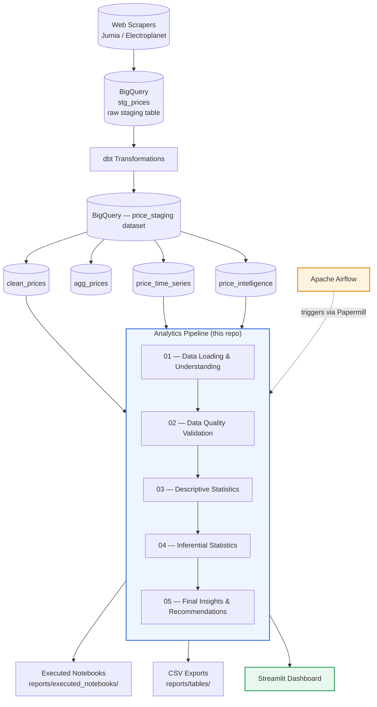

# 📊 Real-Time E-commerce Price Intelligence Platform — Analytics Module

> Statistical analysis pipeline for monitoring, comparing, and explaining product price behavior across Moroccan e-commerce platforms (Jumia Morocco & Electroplanet).

---

## 🎯 Project Overview

This module is the **analytics layer** of a larger Real-Time E-commerce Price Intelligence Platform. Raw product data is scraped, ingested, and transformed upstream (via dbt) into clean BigQuery tables. This repository takes those transformed tables and turns them into **statistical insights and business recommendations** through a sequence of five Jupyter notebooks, automatically executed with Papermill and orchestrated by Apache Airflow.

**Dataset at a glance:**

| Metric | Value |
|---|---|
| Cleaned price observations | 10,523 |
| Unique products | 934 |
| E-commerce sites | 2 (Jumia Morocco, Electroplanet) |
| Product categories | 18 |
| Observation period | May 1, 2026 – June 10, 2026 |

---

## 🏗️ Architecture



**Data flow summary:**
1. Product prices are scraped from Jumia Morocco and Electroplanet.
2. Raw data lands in BigQuery (`stg_prices`).
3. dbt transforms and models the data into `clean_prices`, `agg_prices`, `price_time_series`, and `price_intelligence`.
4. Apache Airflow triggers the analytics notebooks via Papermill on a schedule.
5. Running the notebooks directly and automatically produces three outputs: executed notebooks, CSV exports, and the Streamlit dashboard.

---

## 📓 Notebook Pipeline

| # | Notebook | Purpose |
|---|---|---|
| 01 | `01_data_loading_and_understanding.ipynb` | Connects to BigQuery, loads core tables, explores schema, time coverage, and dataset dimensions |
| 02 | `02_data_quality_validation.ipynb` | Checks missing values, duplicates, invalid prices, and time-series coverage/consistency |
| 03 | `03_descriptive_statistics.ipynb` | Computes central tendency, dispersion, price volatility, category-level trends, and time-series visualizations |
| 04 | `04_inferential_statistics.ipynb` | Normality testing, Mann-Whitney U, Kruskal-Wallis, post-hoc tests, regression modeling, confidence intervals, power analysis |
| 05 | `05_final_insights_and_recommendations.ipynb` | Synthesizes findings, discusses limitations, and provides business recommendations |

---

## 📈 Key Findings

- **Price distribution is highly right-skewed**: mean ≈ 1,801.67 MAD vs. median ≈ 979 MAD, driven by high-end electronics (gaming PCs, MacBooks, ultrabooks).
- **Strong dispersion**: standard deviation ≈ 2,971.10 MAD; prices range from 15 MAD to 39,999 MAD.
- **Platform comparison**: Electroplanet shows higher average and median prices than Jumia Morocco (Mann-Whitney U test, statistically significant), though this is partly explained by differing catalog compositions.
- **Category is the dominant price driver**: Kruskal-Wallis test confirms significant differences across the 18 categories; premium computing categories (`pc-gamer`, `ultrabook`, `macbook`, `pc-hybride`, `notebook`) sit at the top of the price scale.
- **Engagement variables**: weak positive correlation between price and rating; moderate negative correlation between price and review count.
- **Regression modeling**: rating, review count, and time explain ~29% of log-price variance (R²); adding product category raises R² to ~70%, confirming category as the strongest explanatory factor.
- **Confidence intervals & power analysis**: bootstrap CIs for Jumia vs. Electroplanet mean prices do not overlap, and the effect size is large with sufficient statistical power to detect it.

---

## ⚠️ Limitations

- **Sample imbalance**: far more observations from Jumia Morocco than from Electroplanet.
- **Catalog mismatch**: the two platforms don't sell identical product lines, so cross-site comparisons may reflect product mix as much as pricing strategy.
- **Missing data**: `rating` and `review_count` have substantial missingness due to scraping constraints; related analyses use complete cases only.
- **Limited time window**: ~6 weeks of observations — sufficient for short-term monitoring, but too short to capture long-term seasonality.

---

## 🔬 Statistical Methods Used

| Category | Methods |
|---|---|
| Descriptive | Mean, median, variance, standard deviation, quartiles, IQR |
| Normality | Shapiro-Wilk test |
| Platform comparison | Mann-Whitney U test |
| Category comparison | Kruskal-Wallis test |
| Post-hoc analysis | Pairwise Mann-Whitney with Benjamini-Hochberg correction |
| Correlation | Spearman rank correlation |
| Regression | OLS on log-transformed price |
| Confidence intervals | Bootstrap resampling |
| Power analysis | Cohen's d and required sample size for 80% power |

---

## ⚙️ Setup & Usage

### 1. Environment setup

```bash
python -m venv venv
source venv/bin/activate   # on Windows: venv\Scripts\activate
pip install -r requirements.txt
```

### 2. Google Cloud authentication

```bash
gcloud auth application-default login
gcloud auth application-default set-quota-project YOUR_PROJECT_ID
```

### 3. Run notebooks manually

```bash
python scripts/run_notebook.py \
  --project-id YOUR_PROJECT_ID \
  --dataset-id price_staging \
  --run-date 2026-06-11 \
  --output-dir reports
```

### 4. Automated execution (Papermill + Airflow)

The notebooks (01–04) are executed in sequence by Papermill, orchestrated as part of the dbt post-transformation pipeline in Apache Airflow.

| Parameter | Description | Default |
|---|---|---|
| `PROJECT_ID` | GCP Project ID | `your-project-id` |
| `DATASET_ID` | BigQuery dataset | `price_staging` |
| `RUN_DATE` | Execution date | today's date |
| `OUTPUT_DIR` | Output directory | `reports` |

**Outputs:**
- Executed notebooks → `reports/executed_notebooks/`
- CSV exports → `reports/tables/`

> ℹ️ Generated reports are excluded from version control via `.gitignore` and recreated automatically on each Airflow run.

---

## ✅ CI/CD

Defined in `.github/workflows/analytics-ci.yml`, runs on every push/PR to `main` and `develop`:

| Job | Description |
|---|---|
| `lint` | Flake8 checks for syntax errors and undefined variables |
| `validate-imports` | Confirms core libraries import correctly (pandas, numpy, scipy, statsmodels, scikit-learn, pingouin, plotly, matplotlib, seaborn) |
| `validate-notebooks` | Validates notebook structure via `nbformat` |
| `validate-streamlit` | Syntax check on `dashboard/streamlit_app.py` |
| `validate-runner` | Syntax check on `run_notebook.py` |

> Dependency versions are pinned to `requirements.txt`. Only direct dependencies are installed to keep the pipeline fast and stable.

---

## 📂 Data Sources (BigQuery — `price_staging` dataset)

| Table | Description |
|---|---|
| `stg_prices` | Raw staging table |
| `clean_prices` | Cleaned product price observations (main analysis table) |
| `agg_prices` | Aggregated product-level price metrics |
| `price_time_series` | Time-series product price observations |
| `price_intelligence` | Latest product-level price intelligence view |

---

## 🛠️ Tech Stack

`Python` · `pandas` / `numpy` · `scipy` / `statsmodels` / `pingouin` · `scikit-learn` · `matplotlib` / `seaborn` / `plotly` · `BigQuery` · `dbt` · `Apache Airflow` · `Papermill` · `Streamlit`
